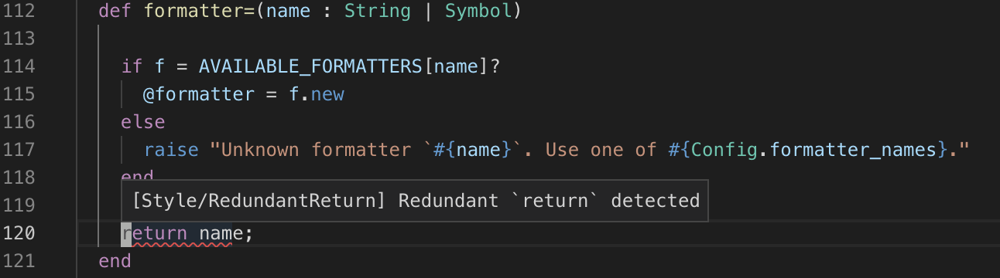

# Ameba for Visual Studio Code

This extension provides interface to [ameba](https://github.com/veelenga/ameba) for VSCode.

## Installation

* Install [Ameba](https://github.com/veelenga/ameba#installation)
* Type F1 (or Command + Shift + P)
* execute "Extensions: install extension"
* type ameba and execute `ext install crystal-ameba